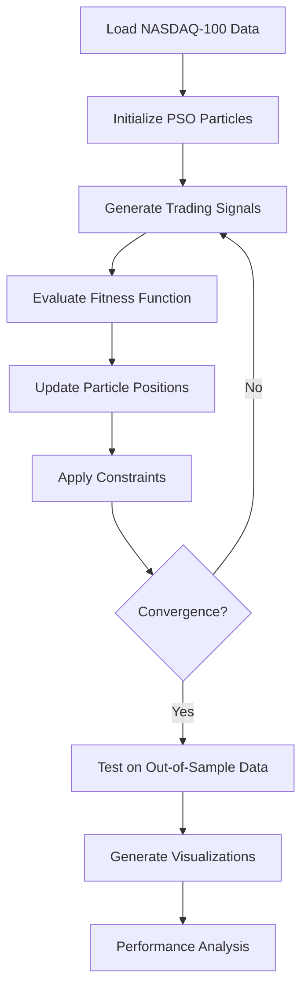

# GPU-Accelerated PSO Trading Strategy Optimizer

## Project Structure

```
pso-trading-optimizer/
├── README.md                           # Project documentation
├── LICENSE                            # MIT License
├── requirements.txt                   # Python dependencies
├── .gitignore                        # Git ignore file
├── docs/                             # Additional documentation
│   ├── algorithm_details.md          # PSO algorithm explanation
│   ├── trading_rules.md             # Trading rules documentation
│   └── performance_analysis.md      # Results and analysis
├── src/                              # Source code
│   ├── exam_pso_gpu_toy.py          # Main PSO implementation
│   ├── nasdaq100_scraping.py        # Data collection script
│   └── utils/                        # Utility modules
│       ├── __init__.py
│       ├── data_loader.py            # Data loading utilities
│       ├── trading_rules.py          # Trading rules implementation
│       └── visualization.py         # Plotting utilities
├── data/                             # Data files
│   ├── nasdaq100_2012_2020.csv      # Historical stock data
│   └── processed/                    # Processed data files
├── results/                          # Output files and results
│   ├── equity_lines.png             # Equity curve plots
│   ├── historycal_weights.png       # Weight evolution plots
│   ├── rules1.png                   # Trading rules visualization
│   ├── rules2.png                   # Performance metrics
│   ├── rules3.png                   # Signal analysis
│   ├── rules4.png                   # Risk analysis
│   ├── rules5.png                   # Optimization progress
│   ├── rules6.png                   # Final results
│   └── reports/                     # Generated reports
│       ├── optimization_summary.txt  # Text summary
│       └── performance_metrics.json # Performance data
├── notebooks/                        # Jupyter notebooks
│   ├── data_exploration.ipynb       # Data analysis
│   ├── strategy_development.ipynb   # Strategy development
│   └── results_analysis.ipynb      # Results visualization
└── tests/                           # Unit tests
    ├── __init__.py
    ├── test_pso.py                  # PSO algorithm tests
    ├── test_trading_rules.py       # Trading rules tests
    └── test_data_loader.py         # Data loading tests
```

## Key Components

### 1. Core Algorithm (`exam_pso_gpu_toy.py`)

- **PSOOptimizerGPU**: Main PSO implementation with GPU acceleration
- **TradingRulesGPU**: GPU-accelerated trading signal generation
- **Portfolio optimization**: Risk management and position sizing

### 2. Data Pipeline (`nasdaq100_scraping.py`)

- Yahoo Finance data collection
- Data preprocessing and cleaning
- Return calculation and normalization

### 3. Visualization Suite

- Interactive particle movement plots
- Equity curve analysis
- Weight evolution tracking
- Performance metrics dashboard

### 4. Trading Rules Implementation

- **Moving Average (MA)**: 50 different MA crossover strategies
- **Trading Range Breakout (TRB)**: 20 breakout strategies
- Dynamic weight adjustment based on profitability

## Algorithm Flow



## Performance Characteristics

### Computational Efficiency

- **GPU Acceleration**: 10-50x speedup vs CPU implementation
- **Parallel Processing**: Simultaneous evaluation of multiple particles
- **Memory Optimization**: Efficient tensor operations

### Trading Performance

- **Training Period**: 2012-2015 (60% of data)
- **Testing Period**: 2016-2020 (40% of data)
- **Benchmark**: Buy-and-hold NASDAQ-100 strategy

### Risk Management

- **Position Sizing**: Maximum 10% allocation per stock
- **Transaction Costs**: 0.1% per trade
- **Leverage Limits**: Maximum 10x initial capital
- **Drawdown Controls**: Dynamic position adjustment

## Getting Started

1. **Environment Setup**

   ```bash
   git clone <repository-url>
   cd pso-trading-optimizer
   pip install -r requirements.txt
   ```

2. **Run Optimization**

   ```bash
   python src/exam_pso_gpu_toy.py
   ```

3. **View Results**
   - Check `results/` folder for generated plots
   - Review performance metrics in terminal output
   - Analyze equity curves and optimization progress

## Configuration Options

### PSO Parameters

- `num_particles`: Number of particles in swarm (default: 10)
- `max_iterations`: Maximum optimization iterations (default: 100)
- `inertia_weight`: Particle momentum factor (default: 0.9)
- `c1`, `c2`: Cognitive and social parameters (default: 2.5, 0.5)

### Trading Parameters

- `initial_equity`: Starting capital per stock ($100,000)
- `transaction_cost`: Trading cost percentage (0.1%)
- `memory_span`: Signal smoothing window (150-300 days)
- `review_span`: Performance review period (20-150 days)

## Academic Context

This project was developed for an **oral examination in Computational Finance**, demonstrating:

- **Advanced Optimization**: Metaheuristic algorithms in finance
- **GPU Computing**: High-performance parallel processing
- **Quantitative Trading**: Systematic strategy development
- **Risk Management**: Practical trading constraints
- **Statistical Analysis**: Out-of-sample validation techniques

## Next Steps

1. **Repository Creation**: Initialize Git repository and push to GitHub
2. **Documentation**: Add detailed algorithm explanations
3. **Testing**: Implement comprehensive unit tests
4. **Optimization**: Parameter sensitivity analysis
5. **Extensions**: Multi-asset and alternative algorithms
