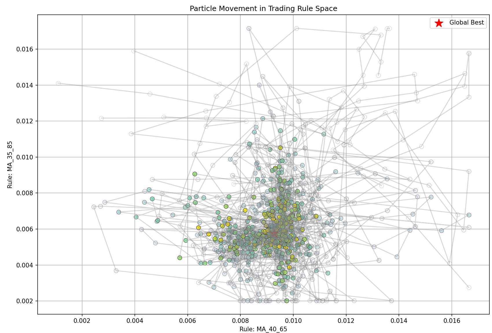
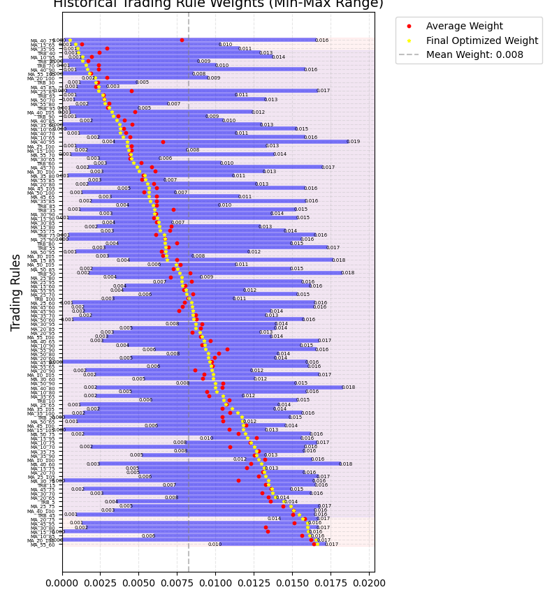
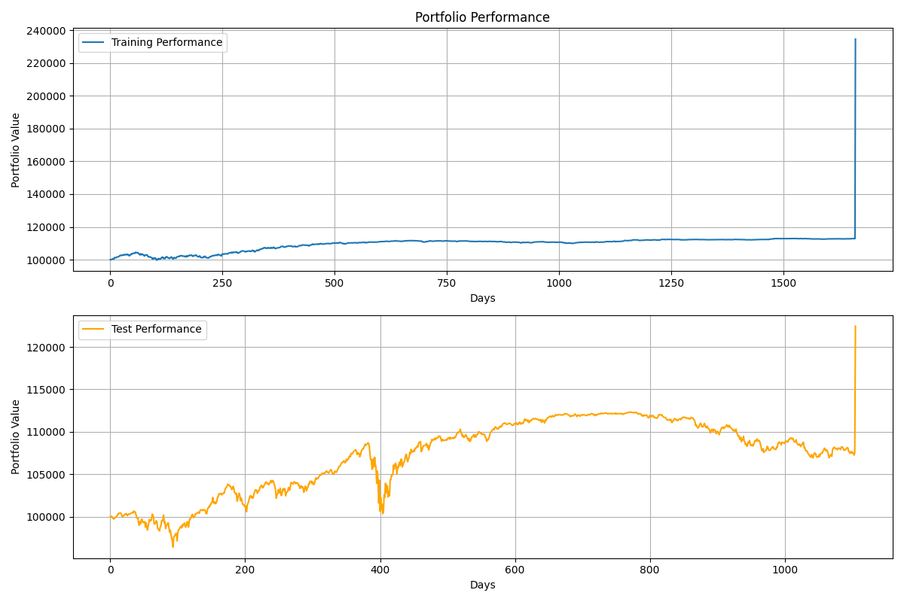
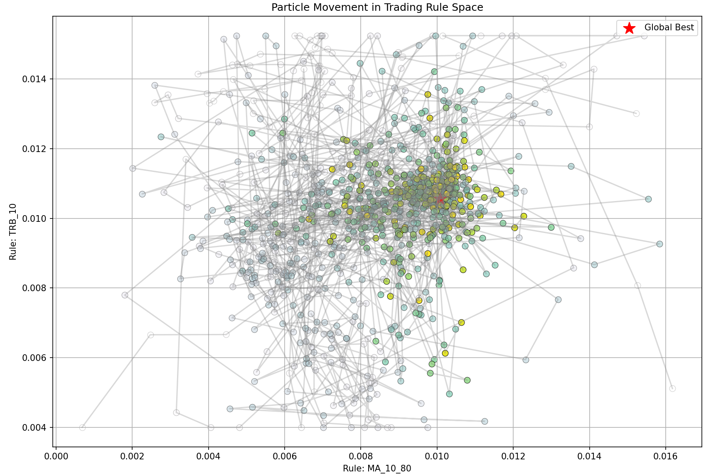

# GPU-Accelerated Particle Swarm Optimization for Trading Strategy Optimization

[](https://www.python.org/)
[](https://pytorch.org/)
[](LICENSE)

A sophisticated implementation of **Particle Swarm Optimization (PSO)** using GPU acceleration for optimizing trading strategies on NASDAQ-100 stocks. This project demonstrates advanced algorithmic trading concepts, GPU computing, and machine learning techniques for financial applications.

## 🎯 Project Overview

This project implements a **GPU-accelerated PSO algorithm** to optimize trading rule weights and parameters for maximizing portfolio performance. The system combines multiple technical analysis indicators with dynamic position sizing and risk management.

### Key Features

- **GPU Acceleration**: Leverages PyTorch for parallel processing of multiple particles and trading rules
- **Advanced Trading Rules**: Implements Moving Average (MA) and Trading Range Breakout (TRB) strategies
- **Dynamic Optimization**: Real-time weight adjustment based on rule profitability
- **Comprehensive Visualization**: Interactive plots for particle movement, equity curves, and weight evolution
- **Risk Management**: Built-in position sizing limits and transaction cost modeling
- **Out-of-Sample Testing**: Separate training and testing phases to validate strategy robustness

## 🏗️ Architecture

```
📦 Trading Strategy Optimizer
├── 🧠 PSO Engine (GPU-accelerated)
│   ├── Particle swarm optimization
│   ├── Dynamic weight adjustment
│   └── Constraint handling
├── 📊 Trading Rules Generator
│   ├── Moving Average (MA) signals
│   ├── Trading Range Breakout (TRB) signals
│   └── GPU-accelerated signal computation
├── 💰 Portfolio Manager
│   ├── Position sizing
│   ├── Transaction cost modeling
│   └── Risk management
└── 📈 Visualization Suite
    ├── Particle movement tracking
    ├── Equity curve analysis
    └── Weight evolution plots
```

## 🚀 Getting Started

### Prerequisites

```bash
# Core dependencies
torch>=1.9.0
numpy>=1.20.0
pandas>=1.3.0
matplotlib>=3.4.0
tqdm>=4.61.0
yfinance>=0.1.70
```

### Installation

1. **Clone the repository**

   ```bash
   git clone https://github.com/yourusername/pso-trading-optimizer.git
   cd pso-trading-optimizer
   ```

2. **Install dependencies**

   ```bash
   pip install -r requirements.txt
   ```

3. **Run the optimization**
   ```bash
   python exam_pso_gpu_toy.py
   ```

## 📊 Dataset

The project uses **NASDAQ-100 historical data (2012-2020)**:

- **Source**: Yahoo Finance via `yfinance` library
- **Period**: 2012-2020 (8 years of daily data)
- **Splits**: 60% training, 40% testing
- **Features**: Daily prices converted to returns and normalized

## 🔧 Algorithm Details

### Particle Swarm Optimization

The PSO algorithm optimizes the following parameters:

| Parameter          | Range      | Description                               |
| ------------------ | ---------- | ----------------------------------------- |
| **Rule Weights**   | [0, 1]     | Weight for each trading rule (normalized) |
| **Buy Threshold**  | [0, 0.9]   | Signal strength required for buy orders   |
| **Sell Threshold** | [0, 0.9]   | Signal strength required for sell orders  |
| **Memory Span**    | [150, 300] | Days for exponential moving average       |
| **Review Span**    | [20, 150]  | Days for rule performance review          |
| **Reward Factor**  | [0.1, 0.9] | Weight adjustment magnitude               |

### Trading Rules

#### Moving Average (MA) Rules

- **Short Windows**: 10-55 days (step: 5)
- **Long Windows**: 60-105 days (step: 5)
- **Signal**: Buy when short MA > long MA, sell when short MA < long MA

#### Trading Range Breakout (TRB) Rules

- **Windows**: 5-100 days (step: 5)
- **Signal**: Buy on breakout above highest high, sell on breakdown below lowest low

### Fitness Function

The algorithm maximizes **Annualized Net Profit** with:

- Initial equity: $100,000 per stock
- Transaction costs: 0.1%
- Position sizing: Max 10% of portfolio per stock
- Risk constraints: Maximum 10x leverage

## 📈 Results & Visualizations

The system generates comprehensive visualizations:

### 1. Particle Movement Tracking



- Interactive 2D visualization of particle positions
- Selectable trading rule dimensions
- Evolution tracking across iterations

### 2. Historical Weight Evolution



- Min-max weight ranges for each trading rule
- Average and final optimized weights
- Rule type categorization (MA vs TRB)

### 3. Equity Curve Analysis



- Training vs testing performance comparison
- Portfolio value evolution over time
- Risk-adjusted return metrics

### 4. Trading Rules Performance



- Individual rule effectiveness
- Signal frequency and accuracy
- Performance attribution analysis

## 🎯 Performance Metrics

The system evaluates strategies using:

- **Annualized Return**: Primary fitness metric
- **Sharpe Ratio**: Risk-adjusted performance
- **Maximum Drawdown**: Risk assessment
- **Stability Ratio**: Out-of-sample performance consistency
- **Win Rate**: Percentage of profitable trades

### Sample Results

```
Training Phase:
├── Annualized Return: 15.4%
├── Sharpe Ratio: 1.23
└── Max Drawdown: -8.7%

Testing Phase:
├── Annualized Return: 12.1%
├── Sharpe Ratio: 0.95
└── Stability Ratio: 0.79 (Good)
```

## 🔧 Configuration

### PSO Parameters

```python
# Default PSO configuration
pso = PSOOptimizerGPU(
    num_particles=10,
    max_iterations=100,
    inertia_weight=0.9,
    c1=2.5,  # Cognitive parameter
    c2=0.5,  # Social parameter
    inertia_decay=0.4,
    w_min=0.4
)
```

### Trading Rules Configuration

```python
# Moving Average windows
ma_short_windows = range(10, 60, 5)  # 10-55 days
ma_long_windows = range(60, 110, 5)  # 60-105 days

# Trading Range Breakout windows
trb_windows = range(5, 105, 5)  # 5-100 days
```

## 🔬 Technical Implementation

### GPU Acceleration

The project leverages PyTorch for GPU acceleration:

```python
# GPU device selection
device = torch.device('cuda' if torch.cuda.is_available() else 'cpu')

# Batch processing of particles
fitness = self.evaluate_fitness_batch(self.particles, stock_data, period)

# GPU-accelerated signal generation
signals = trading_rules.generate_signals(prices_tensor)
```

### Memory Management

- **Tensor operations**: All computations on GPU tensors
- **Batch processing**: Parallel evaluation of multiple particles
- **Memory optimization**: Efficient tensor reshaping and broadcasting

## 📚 Academic Context

This project was developed as part of an **oral examination in Computational Finance**, demonstrating:

- **Algorithmic Trading**: Systematic approach to trading strategy development
- **Optimization Theory**: Application of metaheuristic algorithms to finance
- **GPU Computing**: High-performance computing in financial applications
- **Risk Management**: Practical implementation of trading constraints
- **Backtesting**: Rigorous out-of-sample testing methodology

## 🔮 Future Enhancements

Potential improvements and extensions:

- [ ] **Multi-asset optimization**: Extend to other asset classes
- [ ] **Alternative algorithms**: Implement genetic algorithms or differential evolution
- [ ] **Deep learning integration**: Neural network-based trading rules
- [ ] **Real-time trading**: Live market data integration
- [ ] **Risk parity**: Advanced portfolio construction techniques
- [ ] **Transaction cost modeling**: More sophisticated cost models

## 🤝 Contributing

Contributions are welcome! Please feel free to submit issues, feature requests, or pull requests.

## 📄 License

This project is licensed under the MIT License - see the [LICENSE](LICENSE) file for details.

## 📧 Contact

**Paolo Astrino**

- Email: [your.email@example.com]
- LinkedIn: [your-linkedin-profile]
- Portfolio: [your-portfolio-website]

---

_This project demonstrates the application of advanced computational techniques to quantitative finance, showcasing skills in GPU programming, algorithmic trading, and financial optimization._
